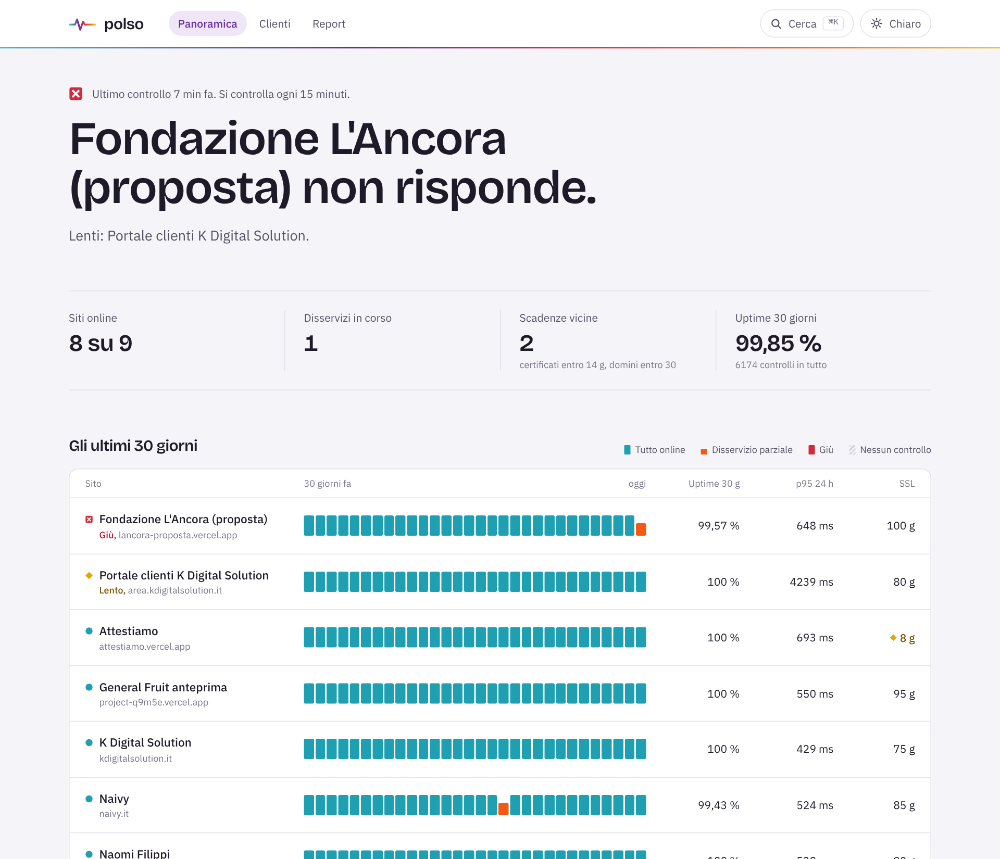
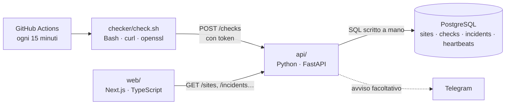

# Polso

Monitor dei siti web per uno studio che gestisce i siti dei propri clienti.
Ogni 15 minuti controlla se i siti rispondono, se mostrano la pagina giusta, quanto sono veloci, quali protezioni di sicurezza hanno e quando scadono certificato e dominio. Apre un incidente quando un sito è giù, lo chiude quando torna online e può avvisare su Telegram. Per ogni cliente c'è una pagina di stato da condividere e un report mensile da stampare.

**Demo:** dashboard [polso-one.vercel.app](https://polso-one.vercel.app) · API [polso-api.vercel.app/docs](https://polso-api.vercel.app/docs)



## Come funziona



| Parte | Linguaggio | Cosa fa |
|---|---|---|
| `checker/` | **Bash** | Legge la lista dei siti, misura codice HTTP, tempo di risposta, testo atteso, header di sicurezza e scadenza SSL; una volta al giorno legge la scadenza dei domini (RDAP o whois) |
| `db/` e `api/app/sql/` | **SQL** (PostgreSQL) | Schema con vincoli e indici; statistiche con `percentile_cont`, `FILTER`, `LATERAL`, window function `LAG`, `generate_series` |
| `api/` | **Python** (FastAPI) | Riceve i controlli, decide apertura e chiusura degli incidenti, sorveglia le attività programmate, espone statistiche, report e badge SVG |
| `web/` | **TypeScript** (Next.js, Tailwind) | Dashboard, pagine di stato per i clienti, report mensile stampabile, ricerca rapida ⌘K, grafici disegnati in SVG |
| `docker-compose.yml`, `.github/` | Docker, YAML | Avvio locale con un comando, test automatici e controlli programmati in produzione |

## Cosa fa

- **Stato in una frase.** La panoramica dice subito se c'è un problema e quale ("L'Ancora non risponde."), poi una striscia di 30 giorni per sito: azzurro tutto online, arancio disservizio parziale, rosso giù, tratteggio grigio nessun controllo. Ogni stato ha anche una forma e una parola, mai solo il colore.
- **Testo atteso.** Un sito può rispondere 200 e mostrare una pagina di errore: con `cerca=` nel file dei siti conta come online solo se nella pagina c'è quel testo.
- **Protezioni di sicurezza.** Per ogni sito, quali header ci sono (HSTS, CSP, nosniff, protezione dalle cornici, Referrer-Policy, Permissions-Policy), spiegati in parole semplici.
- **Scadenze.** Certificato SSL a ogni controllo, dominio una volta al giorno via RDAP (con whois come ripiego). I sottodomini delle piattaforme (`*.vercel.app`) non scadono e vengono saltati.
- **Pagine di stato per i clienti.** `/stato/<cliente>`: solo i siti di quel cliente, 90 giorni di storico e le interruzioni raccontate a parole, senza menu della dashboard. Si manda con un link.
- **Report mensile.** `/report`: disponibilità, interruzioni e tempi per sito, con il diario degli incidenti; si stampa o si salva in PDF.
- **Attività programmate.** Backup, script notturni, il controllo dei domini: chiamano `/ping/<slug>` quando finiscono, e se tacciono oltre il previsto la dashboard le segna in ritardo e parte un avviso.
- **Badge.** `/badge/<id>.svg` mostra l'uptime a 30 giorni in un README.
- **Ricerca rapida.** ⌘K (o Ctrl+K, o `/`) per saltare a un sito, a un cliente o a una pagina.

## Avvio in locale

Serve Docker.

```bash
cp .env.example .env                              # poi metti una password e un token
cp checker/sites.example.txt checker/sites.txt    # i siti da controllare
docker compose up --build
```

- Dashboard: <http://localhost:3000>
- API e documentazione interattiva: <http://localhost:8000/docs>

Al primo avvio il database contiene tre siti di esempio con 30 giorni di storico, così la dashboard non è vuota.

### Senza Docker

```bash
# database: PostgreSQL 15+ in locale
createdb polso
psql polso -f api/app/sql/schema.sql -f db/seed.sql

# API
cd api && python -m venv .venv && .venv/bin/pip install -r requirements-dev.txt
DATABASE_URL=postgresql://localhost/polso POLSO_INGEST_TOKEN=prova .venv/bin/uvicorn app.main:app --reload

# checker (su Windows: Git Bash o WSL)
POLSO_INGEST_TOKEN=prova ./checker/check.sh --sites checker/sites.txt

# dashboard
cd web && npm install && POLSO_API_URL=http://localhost:8000 npm run dev
```

## Test

```bash
./checker/test_check.sh                       # Bash: server web locale finto, controlla il JSON prodotto
cd api && .venv/bin/pytest                    # Python + SQL: test con un PostgreSQL vero
cd web && npm run lint && npm run typecheck   # TypeScript
```

La CI su GitHub esegue tutto a ogni push, più `shellcheck`, `ruff` e la build delle immagini Docker.

## Scelte tecniche

- **SQL scritto a mano, niente ORM.** Le statistiche (uptime per finestra di tempo, 95° percentile, cambi di stato) sono query vere in file `.sql`, leggibili e provabili in `psql`. Un ORM le avrebbe nascoste.
- **Un solo incidente aperto per sito, garantito dal database.** Un indice unico parziale (`WHERE resolved_at IS NULL`) impedisce i doppioni anche con due richieste in parallelo; il codice Python usa `ON CONFLICT DO NOTHING` e `FOR UPDATE`.
- **Due controlli giù di fila per aprire un incidente.** Uno solo può essere un falso allarme di rete. La regola sta in una funzione pura (`api/app/incidents.py`), testata senza database.
- **Bash per i controlli.** `curl` e `openssl` sono gli strumenti giusti per misurare un sito; lo script gira uguale su un server, in Docker e su GitHub Actions.
- **I controlli girano su GitHub Actions**, non su un server sempre acceso: costo zero. Ogni 15 minuti, a minuti "storti" (7, 22, 37, 52) perché all'ora piena GitHub è affollato e ritarda; i domini una volta al giorno, perché cambiano di rado e i registri limitano le richieste.
- **Niente verde dove non ci sono dati.** Un giorno senza controlli è "nessun controllo", non "online"; l'uptime complessivo è controlli riusciti su controlli fatti, mai una media di percentuali.
- **Le pagine per i clienti sono separate.** Un gruppo di route Next.js (`app/(pubblico)`) ha un layout suo, senza menu né ricerca: il cliente vede solo quello che lo riguarda.
- **Gli avvisi partono una volta sola.** Un'attività in ritardo viene segnata (`late_alerted`) quando parte l'avviso; il ping successivo la rimette in regola e manda l'avviso di ripresa.
- **Sicurezza.** Scrittura protetta da token confrontato in tempo costante, nessun segreto nel codice (`.env.example`), container senza utente root, lista dei siti fuori dal codice (file locale o secret di GitHub). Dashboard e log di GitHub Actions di un repository pubblico sono visibili a tutti: si monitorano solo siti propri o di clienti che sono d'accordo.
- **Grafico senza librerie.** SVG disegnato a mano: tempi medi per ora, ore con disservizio segnate a parte, dettaglio al passaggio del mouse e tabella dei dati per l'accessibilità.

## Come ho usato l'AI

Polso nasce da un'esigenza reale del mio studio: tenere d'occhio i siti dei clienti. Ho deciso io cosa doveva fare, quali siti controllare e come doveva apparire (palette, stati, priorità delle informazioni), ho messo in piedi l'infrastruttura su GitHub, Neon e Vercel e ho guidato ogni modifica. Per scrivere codice e test ho lavorato con Claude come assistente di programmazione, come succede ormai in molti team.

Checker, API e query SQL sono coperti da test automatici che girano a ogni modifica; la dashboard è controllata da TypeScript e lint.

## Documenti

- [`DEPLOY.md`](DEPLOY.md): messa online con Neon, Vercel e GitHub Actions
