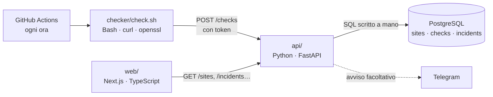

# Polso

Monitor dei siti web per uno studio che gestisce i siti dei propri clienti.
Ogni ora controlla se i siti rispondono, quanto sono veloci e quando scade il certificato SSL; apre un incidente quando un sito è giù e lo chiude quando torna online.

**Demo:** dashboard [polso-one.vercel.app](https://polso-one.vercel.app) · API [polso-api.vercel.app/docs](https://polso-api.vercel.app/docs)


## Come funziona



| Parte | Linguaggio | Cosa fa |
|---|---|---|
| `checker/` | **Bash** | Legge la lista dei siti, misura codice HTTP, tempo di risposta e scadenza SSL, invia i risultati all'API |
| `db/` e `api/app/sql/` | **SQL** (PostgreSQL) | Schema con vincoli e indici; statistiche con `percentile_cont`, `FILTER`, `LATERAL`, window function `LAG`, `generate_series` |
| `api/` | **Python** (FastAPI) | Riceve i controlli, decide apertura e chiusura degli incidenti, espone le statistiche |
| `web/` | **TypeScript** (Next.js, Tailwind) | Dashboard con stato dei siti, grafico dei tempi di risposta disegnato in SVG, incidenti |
| `docker-compose.yml`, `.github/` | Docker, YAML | Avvio locale con un comando, test automatici e controllo orario in produzione |

## Avvio in locale

Serve Docker.

```bash
cp .env.example .env                              # poi metti una password e un token
cp checker/sites.example.txt checker/sites.txt    # i siti da controllare
docker compose up --build
```

- Dashboard: <http://localhost:3000>
- API e documentazione interattiva: <http://localhost:8000/docs>

Al primo avvio il database contiene tre siti di esempio con 30 giorni di storico, così la dashboard non è vuota.

### Senza Docker

```bash
# database: PostgreSQL 15+ in locale
createdb polso
psql polso -f api/app/sql/schema.sql -f db/seed.sql

# API
cd api && python -m venv .venv && .venv/bin/pip install -r requirements-dev.txt
DATABASE_URL=postgresql://localhost/polso POLSO_INGEST_TOKEN=prova .venv/bin/uvicorn app.main:app --reload

# checker (su Windows: Git Bash o WSL)
POLSO_INGEST_TOKEN=prova ./checker/check.sh --sites checker/sites.txt

# dashboard
cd web && npm install && POLSO_API_URL=http://localhost:8000 npm run dev
```

## Test

```bash
./checker/test_check.sh                       # Bash: server web locale finto, controlla il JSON prodotto
cd api && .venv/bin/pytest                    # Python + SQL: test con un PostgreSQL vero
cd web && npm run lint && npm run typecheck   # TypeScript
```

La CI su GitHub esegue tutto a ogni push, più `shellcheck`, `ruff` e la build delle immagini Docker.

## Scelte tecniche

- **SQL scritto a mano, niente ORM.** Le statistiche (uptime per finestra di tempo, 95° percentile, cambi di stato) sono query vere in file `.sql`, leggibili e provabili in `psql`. Un ORM le avrebbe nascoste.
- **Un solo incidente aperto per sito, garantito dal database.** Un indice unico parziale (`WHERE resolved_at IS NULL`) impedisce i doppioni anche con due richieste in parallelo; il codice Python usa `ON CONFLICT DO NOTHING` e `FOR UPDATE`.
- **Due controlli giù di fila per aprire un incidente.** Uno solo può essere un falso allarme di rete. La regola sta in una funzione pura (`api/app/incidents.py`), testata senza database.
- **Bash per i controlli.** `curl` e `openssl` sono gli strumenti giusti per misurare un sito; lo script gira uguale su un server, in Docker e su GitHub Actions.
- **Il controllo orario gira su GitHub Actions**, non su un server sempre acceso: costo zero.
- **Sicurezza.** Scrittura protetta da token confrontato in tempo costante, nessun segreto nel codice (`.env.example`), container senza utente root, lista dei siti fuori dal codice (file locale o secret di GitHub). Dashboard e log di GitHub Actions di un repository pubblico sono visibili a tutti: si monitorano solo siti propri o di clienti che sono d'accordo.
- **Grafico senza librerie.** SVG disegnato a mano: tempi medi per ora, ore con disservizio segnate a parte, dettaglio al passaggio del mouse e tabella dei dati per l'accessibilità.

## Come ho usato l'AI

Polso nasce da un'esigenza reale del mio studio: tenere d'occhio i siti dei clienti. L'ho sviluppato insieme a Claude, usato come assistente di programmazione: architettura, codice e test sono nati in coppia. Checker, API e query SQL sono coperti da test automatici; la dashboard è controllata da TypeScript e lint.

## Documenti

- [`DEPLOY.md`](DEPLOY.md): messa online con Neon, Vercel e GitHub Actions
